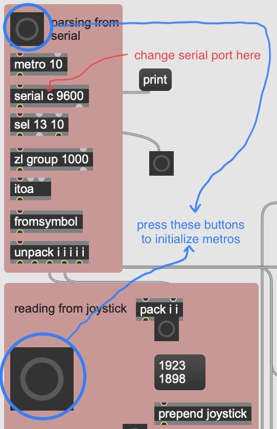

# Alien Radio
An interactive mini music game made with ESP32 and MaxMSP. Travel the universe in search of alien radio channels playing alien sounds!

## [Video Demo](https://www.youtube.com/watch?v=H4B6xMbdaH4)

See detailed explanation [here](https://ryurongliu.github.io/alien-radio/).
  
## Concept
The hardware controller makes use of three inputs: a joystick, a potentiometer, and a momentary switch. 
1. Joystick (MOVE): use the joystick to pilot your spacecraft around.
2. Potentiometer (TUNE): twist the potentiometer to tune in to the alien channels' specific frequencies. Your spacecraft changes color according to the frequency you're currently listening to.
3. Switch (TELEPORT): when you've finished exploring this window of the universe, press the button to teleport to a new area.

The distance from each alien radio station is displayed along the bottom of the screen. Alien stations will appear on the map when you get within 20 units away. Their colors reflect their channel's specific frequency. The universe is populated with four types of alien radio stations.
1. ADDITIVE-ALIEN: these aliens enjoy additive synthesis, with random sequencing based on an initial set of note frequencies.
2. GLOOPY-ALIEN: these aliens play sine waves through lots of delays and panning, also randomized on initial frequencies.
3. GRANULAR-ALIEN: these aliens use granular synthesis on pre-existing (human) music, with randomized grain selection and playback based on initial durations. 
4. BACKWARD-ALIEN: these aliens like to play human music backwards, with LFO-swept panning.

## Tech Specs
- [TTGO T-Display ESP32 WiFi BLE](https://www.amazon.com/LILYGO-T-Display-Arduino-Development-CH9102F/dp/B099MPFJ9M)
- potentiometer
- joystick
- momentary switch

## Reproduction
The components are connected to the ESP32 as follows: 
- potentiometer middle pin to ESP32 pin 12
- potentiometer right pin to EPS32 3V
- potentiometer left pin to ESP32 ground
- joystick VRx to ESP32 pin 13
- joystick VRy to ESP32 pin 25
- joystick SW to ESP32 pin 15 (unused, but good to connect)
- joystick 5V to ESP32 3V
- joystick GR to ESP32 ground 
- momentary switch one side to ESP32 pin 26
- momentary switch other side to ESP32 ground

[inputs.ino](inputs.ino) will work with the above wiring; pin assignments can be changed in the macros as necessary.     
[max_files/alienradio.maxpat](max_files/alienradio.maxpat) is the main MaxMSP patch. The serial port may need to be changed, depending on which port your ESP32 is connected to. Press the two large buttons in the top left to start the main driver metronomes, and then press the momentary switch to initialize a universe neighborhood. You can then enter presentation mode, turn on the audio, and start playing.   
 

If you want GRANULAR-ALIEN and BACKWARDS-ALIEN to sample different human music, simply place two audio files into the folder containing alienradio.maxpat and rename them "grain-1.mp3" and "grain-2.mp3". 

